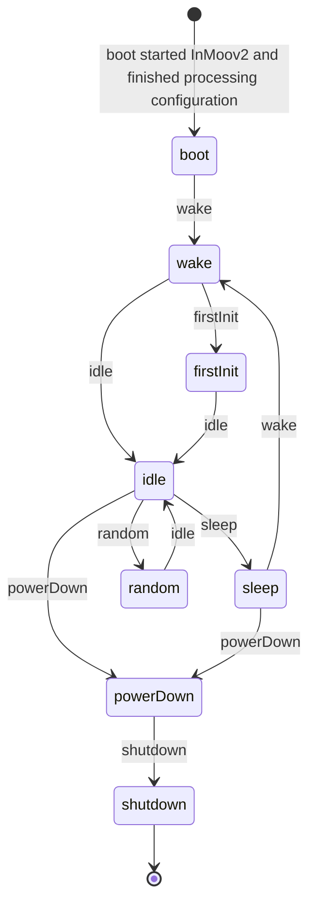
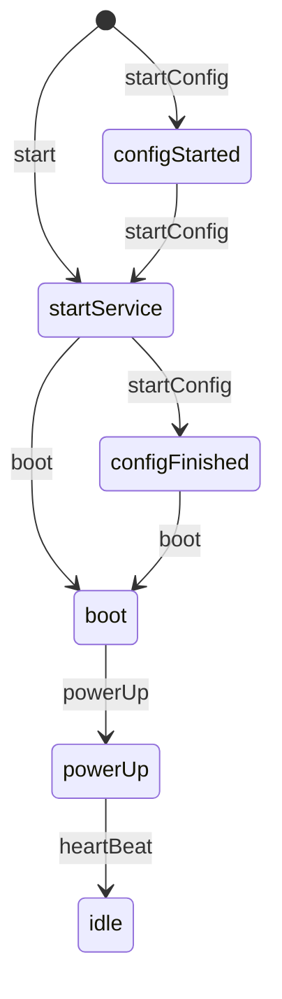
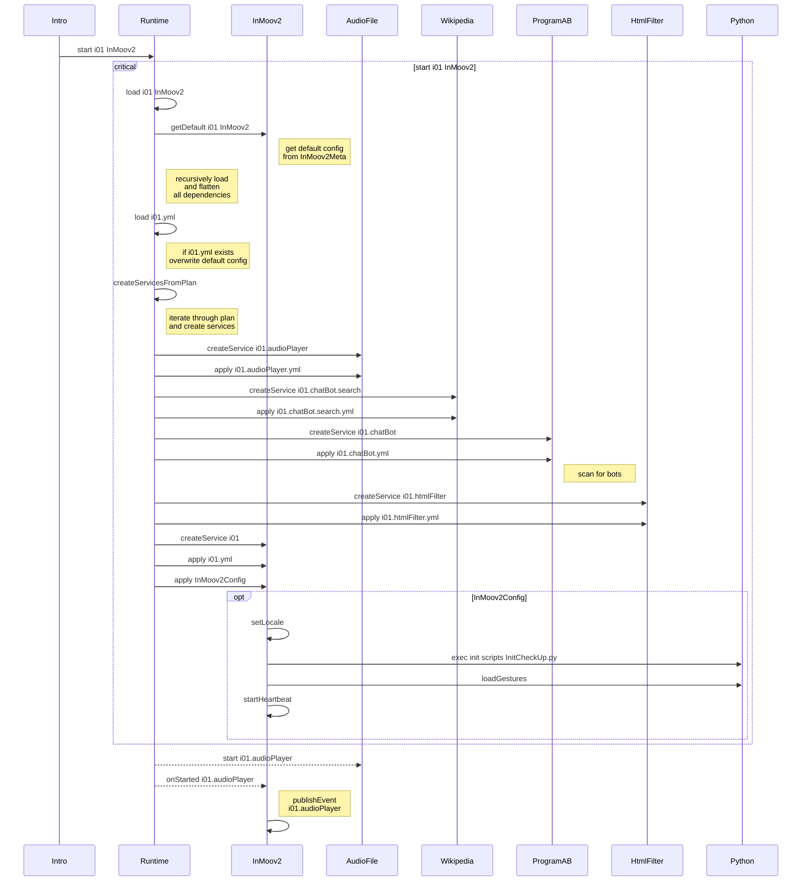

# InMooV - Service dependencies ( gestures, chatbot, language pack, config files, etc ... )    
  
Compatible with Nixie  
  
https://github.com/MyRobotLab/inmoov2
  
  
MORE INFO : http://myrobotlab.org/service/InMoov2


# InMoov2 State Diagram



### boot
Boot state starts after all configuration has processed.
All services started and all errors during startup are reported,
and the main heartbeat timer is started.

* set autoDisable true for all servos
* copy over default config sets
* play the startup sound
* report on services started in the order the were started
* start the heartbeat
* start inactivity timer
* start health check

```python
i01 = runtime.start("i01", "InMoov2")
# or
runtime.startConfig("myInMoovConfig")
```


### wake
Wake state

* if ear has been started, start listening


### firstInit
First init is the first time InMoov and the chatBot is started and
the predicate first_init is set to true.


## Web UI Style Guide
* [Title Caps for field names and elements](https://learn.microsoft.com/en-us/previous-versions/windows/desktop/bb246428(v=vs.85)?redirectedfrom=MSDN)
* [No semi-colons for field names if labels exist](https://ux.stackexchange.com/questions/3611/should-label-and-field-be-separated-with-colon)


_InitCheckUp.py_

```py

# ##############################################################################
#                 INITIAL CHECKUP2
# ##############################################################################

################################
# INIT.1 - system dependencies & language pack
################################
DEBUG=0
log = runtime.start("log", "Log")
runtime.setLogLevel("INFO")
# libraries import
execfile('resource/InMoov2/system/Import_Libraries.py')
# common functions
execfile('resource/InMoov2/system/Import_Functions.py')


#RuningFolder=os.getcwd().replace("\\", "/")+"/"+RuningFolder+"/"
# global vars import
execfile('resource/InMoov2/system/Robot_Satus_GlobalsVars.py')

# we load our custom script
execfile('resource/InMoov2/system/startScripts/InMoovCustom_start.py')

# we load alan's face for facerecognition
execfile('resource/InMoov2/system/startScripts/InMoovTrain_start.py')

# we load a personal config parameters
execfile('resource/InMoov2/system/startScripts/i01_life_config.py')

# vocal errors
execfile('resource/InMoov2/system/Errors.py'.encode('utf8'))

# mute for starting action vocals
#if IsMute==1:i01.setMute(True)
execfile('resource/InMoov2/life/0_inmoovLife.py')
################################
# INIT.2 - services call
################################
#we load services python side from services folder
#for filename in sorted(os.listdir('resource/InMoov2/services')):    
  #if os.path.splitext(filename)[1] == ".py":
    #execfile('resource/InMoov2/services/'+filename.encode('utf8'))
    #if DEBUG==1:print filename
execfile('resource/InMoov2/services/1_AudioFile.py')
execfile('resource/InMoov2/services/3_ImageDisplay.py')
execfile('resource/InMoov2/services/4_Ear.py')
execfile('resource/InMoov2/services/5_Mouth.py')
#6_Arduino.py ## NOT NECESSARY FOR NIXIE
#7_Inmoov.py  ## NEED FIXING FOR NIXIE
#8_NervoBoardRelay.py  ##NEED FIXING FOR NIXIE
execfile('resource/InMoov2/services/9_neoPixel.py')
execfile('resource/InMoov2/services/A_Chatbot.py')
#B_Wikidata.py  ## NOT NECESSARY FOR NIXIE?
execfile('resource/InMoov2/services/C_Pir.py')
execfile('resource/InMoov2/services/D_OpenCv.py')
#E_Oak.py ## WOULD REPLACE KINECT
#F_VirtualInmoov.py ## NOT NECESSARY FOR NIXIE?
#G_Translator.py ## NEED FIXING FOR NIXIE
execfile('resource/InMoov2/services/H_OpenWeatherMap.py')
#I_UltrasonicSensor.py ## NEED FIXING FOR NIXIE
#J_SensorFinger.py ## NEED FIXING FOR NIXIE
#execfile('resource/InMoov2/services/K_FiniteStateMachine.py')

################################ 
# INIT.3- inmoov loading
################################
    
#we launch Inmoov life
#for root, subdirs, files in os.walk('resource/InMoov2/life'):
  #for name in sorted(files):
    #if name.split(".")[-1] == "py":
      #execfile(os.path.join(root, name))
      #if DEBUG==1:print "debug inmoov Life : ",os.path.join(root, name)
execfile('resource/InMoov2/life/HealthCheck.py')
execfile('resource/InMoov2/life/shutdown.py')
execfile('resource/InMoov2/life/shutdownComplete.py')
execfile('resource/InMoov2/life/sleepMode.py')
################################

#create the custom script, only if not exist
#if not os.path.isfile('data/InMoov2/InMoov_custom.py'):shutil.move('resource/InMoov2/custom/InMoov_custom.py','data/InMoov2/custom/InMoov_custom.py')
# launch custom script
#execfile('data/InMoov2/InMoov_custom.py')

################################
# INIT.4 - great, inmoov is alive
################################

if DEBUG==1:runtime.setLogLevel("INFO")
else:runtime.setLogLevel("ERROR")
if runtime.isStarted('i01.neopixel'):    
  i01.setNeopixelAnimation("Flash Random", 0, 255, 0, 1)
  sleep(2)
  i01.stopNeopixelAnimation()
  sleep(1)
  i01.setNeopixelAnimation("Flash Random", 0, 255, 50, 10)
sleep(1)
welcomeMessage()


```





# InMoov2 Start Sequence



### configStarted
When InMoov is started from a configuration set, or Runtime is configured to automatically load a config set.
```python
runtime.startConfig("myInMoovConfig")
# used to auto start the config next time mrl is started
runtime.setAutoStart(True)
```

### startService
When InMoov is started from Intro or the Python service is used to start the service without configuration.
e.g.
```python
i01 = runtime.start("i01", "InMoov2")
```

