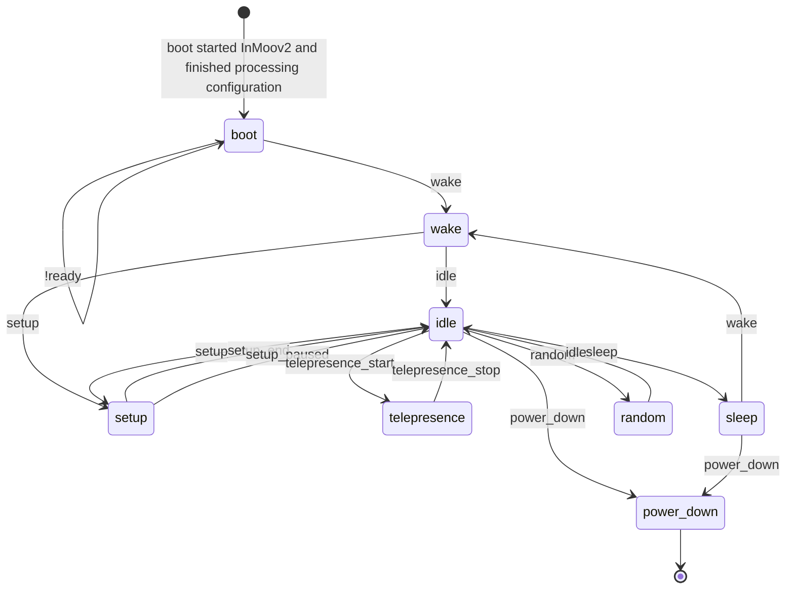

# InMooV - Service dependencies ( gestures, chatbot, language pack, config files, etc ... )    
  
Compatible with Nixie  
  
https://github.com/MyRobotLab/inmoov2
  
  
MORE INFO : http://myrobotlab.org/service/InMoov2

# InMoov2 State Diagram

### boot
Boot state is when all configuration is processing.
All services will be started if configured before leaving this state.

* set autoDisable true for all servos
* copy over default config sets
* play the startup sound
* report on services started in the order the were started
* start the heartbeat
* start inactivity timer
* start health check

### wake
Waking from slumber, sensors begin to flow in data and the robot should try to identify
where it is and switch their attention to the person of focus.

* Heartbeat started
* Start OakD/OpenCV
* If ear has been started, start listening
* Figure out what time / date it is
* Try to determine where we are
* See if there are people around
* If there are people, determine who they are
* Take physical inventory, e.g. how am i feeling, report errors if they exist

### setup
First init is the first time InMoov and the chatBot is started and
the predicate setup is set to true.

## Web UI Style Guide
* [Title Caps for field names and elements](https://learn.microsoft.com/en-us/previous-versions/windows/desktop/bb246428(v=vs.85)?redirectedfrom=MSDN)
* [No semi-colons for field names if labels exist](https://ux.stackexchange.com/questions/3611/should-label-and-field-be-separated-with-colon)

